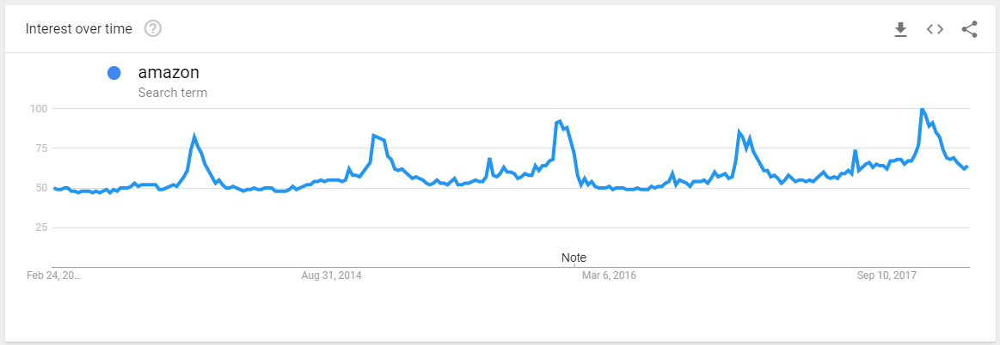
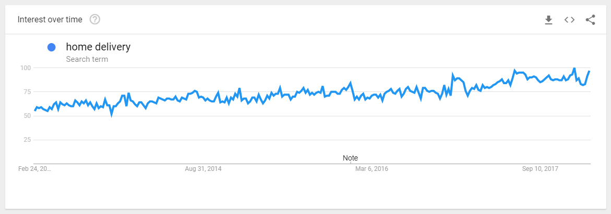

# babysitting-system

## Gestora de Projeto

```text
     _____                      ___           ___           ___                    ___           ___           ___                       ___
    /  /::\       ___          /  /\         /__/\         /  /\                  /  /\         /  /\         /  /\          ___        /  /\
   /  /:/\:\     /  /\        /  /::\        \  \:\       /  /::\                /  /:/        /  /::\       /  /:/_        /  /\      /  /::\
  /  /:/  \:\   /  /:/       /  /:/\:\        \  \:\     /  /:/\:\              /  /:/        /  /:/\:\     /  /:/ /\      /  /:/     /  /:/\:\
 /__/:/ \__\:| /__/::\      /  /:/~/::\   _____\__\:\   /  /:/~/::\            /  /:/  ___   /  /:/  \:\   /  /:/ /::\    /  /:/     /  /:/~/::\
 \  \:\ /  /:/ \__\/\:\__  /__/:/ /:/\:\ /__/::::::::\ /__/:/ /:/\:\          /__/:/  /  /\ /__/:/ \__\:\ /__/:/ /:/\:\  /  /::\    /__/:/ /:/\:\
  \  \:\  /:/     \  \:\/\ \  \:\/:/__\/ \  \:\~~\~~\/ \  \:\/:/__\/          \  \:\ /  /:/ \  \:\ /  /:/ \  \:\/:/~/:/ /__/:/\:\   \  \:\/:/__\/
   \  \:\/:/       \__\::/  \  \::/       \  \:\  ~~~   \  \::/                \  \:\  /:/   \  \:\  /:/   \  \::/ /:/  \__\/  \:\   \  \::/
    \  \::/        /__/:/    \  \:\        \  \:\        \  \:\                 \  \:\/:/     \  \:\/:/     \__\/ /:/        \  \:\   \  \:\
     \__\/         \__\/      \  \:\        \  \:\        \  \:\                 \  \::/       \  \::/        /__/:/          \__\/    \  \:\
                               \__\/         \__\/         \__\/                  \__\/         \__\/         \__\/                     \__\/
```

Repositório para o projeto de LI4 de 2017/2018. Consiste num sistema de agendamento de babysitters 24/7, com o apoio de um site para os utilizadores e aplicação móvel para funcionários.
Os funcionários devem ter acesso a um mapa onde podem verificar as localizações dos seus agendamentos.

## Motivo

* Porquê fazer?
* O que é suposto resolver?

## Organização do relatório

### 1. Contextualização (CAMPOS)

Uma rede de infantários de luxo pretende criar um serviço de babysitting. As encarregadas acompanharão um determinado pupilo e, a pedido dos pais, sendo o serviço pago hora a hora, quer dentro ou fora do horário do infantário.

### 2. Motivação e objetivos (CAMPOS)

Contratados pela empresa, a empresa quer aumentar seus lucros e melhorar qualidade do serviço.

### 3. Definição da identidade do sistema a desenvolver (DIANA)

É um sistema de gestão de serviço de acompanhamento personalizado, providenciado pelo infantário "Crianças de Luxo", cuja aplicação se chamará "GuguDadah". Os pais vão poder requisitar serviços (e determinar a hora dos mesmos), face aos seus filhos e respetivos educadores (que, a partir da primeira utilização, vão tentar ser mantidos). Os educadores vão consultar as suas tarefas e o miúdos. Os pais vão poder controlar o estado atual do serviço a ser executado, e custo associado.

### 4. Análise de Viabilidade (MARCOS)

```text
Rascunho

É viável fazer sistema? quanto vai ganhar a nossa empresa? vai reduzir fluxo de papel? ter informação 24h acessível? vai permitir libertar recursos?
A empresa fez uma análise de mercado e verificou que era rentável a produção da aplicação e posterior serviço, tendo-nos contratado.... (desenvolver)

Em que medida nos como empresa vamos beneficiar (não é o foco)
Quem constitui a procuração para o nosso serviço (pais para os miúdos)
Se tem pernas para andar, se é viável a longo termo, se é um serviço que perdure independentemente do passar do tempo e das "modas"
Procura *
Se conseguimos manter o serviço

diz as cenas face ao ganho do infantario
-> permite um serviço diferenciador e de excelência
-> melhora a motivação dos putos para ir à escola
merdas assim
é na mm ordem de ideias que o reduzir papel etc
```

De maneira a analisar a viabilidade deste novo serviço, coube-nos cumprir o papel de construir sobre a análise de mercado inicial da empresa contratante, adicionando também a esta análise um estudo da adequação deste empreendimento às circunstâncias da nossa atividade de consultadoria.

Um sistema de entregas ao domicílio 24/365 é um modelo de negócio cada vez mais comum no tempo presente, e esta proposta demonstra uma abertura do cliente à adaptação contínua e adoção de novas formas de comércio.

A popularidade deste modelo indica à partida a viabilidade da solução. Foi realizada, assim mesmo, uma pesquisa breve relativa à presença destes tipos de negócio no mercado atual.

Constatamos rapidamente que a adoção das entregas ao domicílio é cada vez mais geral, havendo anúncios da abertura destes serviços por parte de grandes marcas com uma frequência elevada. Seguem alguns exemplos:

* "The owner of KFC and Taco Bell is teaming up with Grubhub to expand home delivery [...]" (8 Fev, 2018)
* "McDonald's cheers home delivery success as UK spurs sales rise" (Jan 30, 2018)
* "UberEats Starts Delivering Food in Detroit Today" (Nov 30, 2017)
* "Burger King já faz entregas ao domicílio em Lisboa" (Jan 6, 2017)

É também de notar o crescimento da Amazon, empresa que melhora continuamente as suas opções de entrega e que recentemente adquiriu a Whole Foods:

* "Amazon starts free, 2-hour Whole Foods deliveries in fresh test of grocery model" (Feb 8, 2018)



De uma forma mais geral, o termo de pesquisa "home delivery" tem visto um crescimento estável já há vários anos, sendo por isso um alvo seguro para um negócio que já esteja estabelecido e queira aumentar as suas chances de se manter relevante numa sociedade que está continuamente em desenvolvimento.



Foi demonstrado acima, de maneira resumida, que o modelo de negócio projetado é popular. No entanto, um leitor atento pode já ter reparado que a o tipo negócio que mais participa nesta adoção tende a estar relacionado com a restauração.

A criação de um serviço de babysitting ao domicílio posiciona-se então como uma opção de entrada num mercado estável e de crescimento contínuo, mas ainda assim inovadora o suficiente para se manter um movimento original, mais do que um investimento trivial.

Foram feitos estudos de mercado com recurso a inquéritos por telefone, que demonstraram uma elevada receptividade à possibilidade de agendar um(a) babysitter a qualquer altura do dia, durante todo o ano.

Foi também descoberto que a perda de confiança comum ao movimento inicial de um serviço para um meio digital é compensada pela presença de avaliações pessoais e rankings no sistema, que aumentam o nível de transparência face ao consumidor.

Uma posterior avaliação da proposta por parte de um comité de gestores concluiu que o orçamento estipulado é adequado ao nível de complexidade do projeto. Havendo a possibilidade de manutenção a longo termo, e tendo em conta as projeções positivas da receção do novo modelo de negócio, este empreendimento é dado como uma mais valia para a nossa organização.

### 5. Identificação dos recursos necessários (VITOR)

Recursos necessários (pessoas necessárias), entrevistas (pais, encarregados, infantario), contactos.
(não falar de ferramentas, é óbvio)

### 6. Modelo de sistema (maquete) (MARCOS V1)

* não é use cases, etc
* é suposto dizer como o sistema vai funcionar num conjunto de caixas, imagem q explique funcionamento
* user mete dados, o q guardo no sistema, conjunto de pedidos em q tenho uma plataforma móvel, etc
* tb posso dizer , na parte do q guardo do sistema, posso dizer ah tenho uma impressora, é aqui q se guardam as faturas, tickets, .....
* falar de quando é feito o acknowlegment
* BONECO, CAIXA, CAIXA, CAIXA, ..., BONECO e descrever cada caixa/etapa (pode se desenhar tb a cloud/seridor )

### 7. Def medidas de sucesso (SERGIO ponto 1,2   ///   VITOR ponto 3,4)

* Software deve responder aos requisitos do cliente
* Execução dentro do tempo proposto
* (+ pesquisar success measures)
* (é possível que haja vários serviços e na próxima fase podemos descrever apenas parte dos serviços)

### 8. Plano de desenvolvimento (DIANA)

* Diagrama de Gantt
* enumerar tarefas/descrever e fazer diagrama
* nota: contabilizar o tempo real que gastamos nisto, para ver o custo do projeto (converter hora em €)

### 9. Organização do Documento (SERGIO)

### 10. Conclusões e trabalho futuro (VITOR)

## Notas

* **Pesquisar subfuncionamento dos subsistemas para melhor fundamentar o projeto**
* empresa tipo airbnb, uber, nao tem posse de nada, oferece serviços. pessoal especializado e certificado.
* fotos de hora a hora, videos
* profissionais avaliados pelos pais, ranking
* nome empresa: GuguDada
* "De pais, para paiss"

### Ideia

* Os pais que tenham os filhos a frequentar o infantário têm desconto em serviços ao domicílio de qualquer tipo.
* Todos os utilizadores têm um "perfil" na aplicação que pode conceder uma acumulação de "pontos(?)" que dá desconto ao fim de x serviços.
